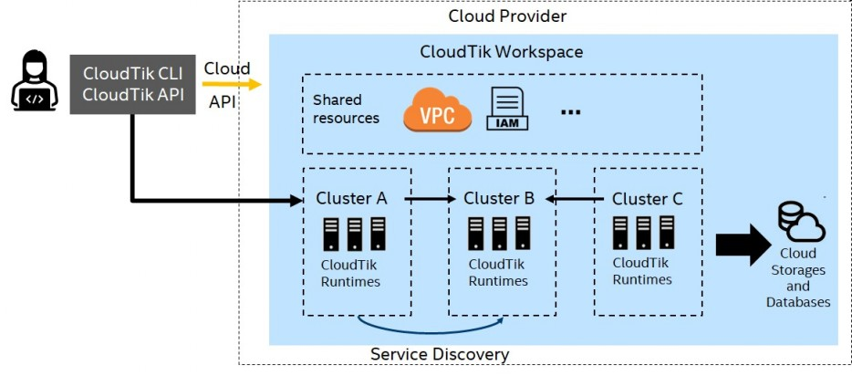
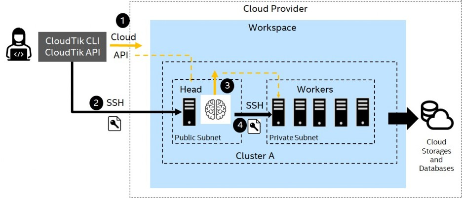
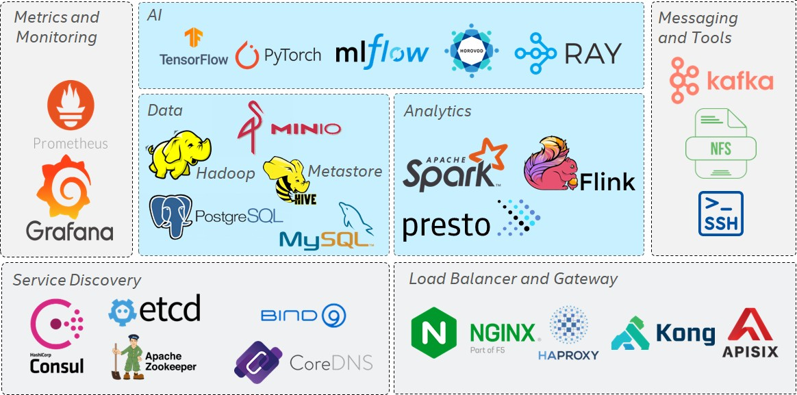
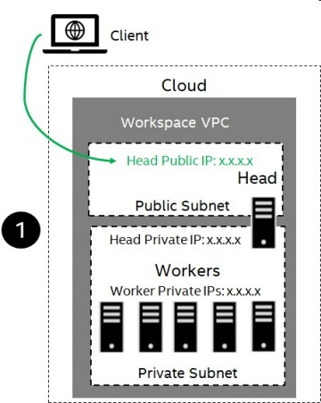
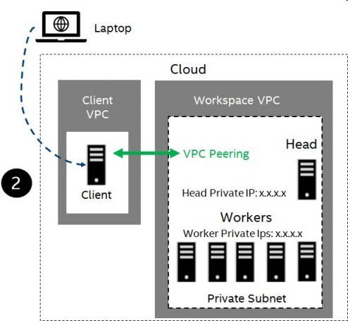
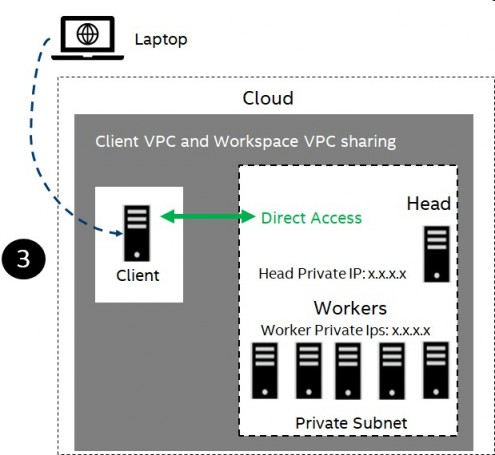
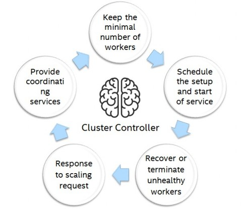

# Architecture Overview
This section gives an overview of the CloudTik Architecture. Although to understand the system
architecture is not a must for users of CloudTik, it will be helpful for user to master CloudTik
more easily if such knowledge is in mind.

- [High Level Architecture](#high-level-architecture)
- [Cluster Architecture](#cluster-architecture)
- [Runtime Architecture](#runtime-architecture)
- [Cluster Networking](#cluster-networking)
- [Cluster Controller](#cluster-controller)

## High Level Architecture
Blow diagram shows the high level system architecture of CloudTik.

User can use CloudTik through a command line interface (CLI) or a python application programming interface (API).
Both CLI and API provides the management operations for both workspace and cluster, for example creating a workspace or
starting a cluster.

The same CLI and API can operate on different cloud providers with a unified workspace and cluster design shown
in the right part of the diagram.

When a workspace for specific cloud provider is created, all the shared resources for implementing the unified
design are created. These include network resources (like VPC, subnets, NAT gateways, firewall rules),
instance profiles, cloud storage and so on. Although the actual resources varies between cloud providers while
the design the resources achieved is consistent.

Within a workspace, one or more clusters can be started. These clusters will share a lot of common configurations
such as network (they are in the same VPC) but vary on other aspects including instance types, scale of the cluster,
services running and so on. The services provided by one cluster can be discovered by other clusters
and be consumed.

The CLI or API interacts with Cloud through two channels. It will use Cloud API to create or manage cloud provider
resources such as launching or terminating a VM instance on cloud. It will use SSH to interact with the VM instance
to perform tasks like installing, configuring and managing the services running on the VM instance.

## Cluster Architecture
Blow diagram shows the cluster architecture and a general internal steps when starting a cluster.

Let's zoom in to have a closer look to a single cluster. A CloudTik cluster includes one head and
zero or more workers.

The head node has a public IP which can be connected through SSH. While the worker nodes are all in
a private subnet which is not directly accessible from Internet.

The process of starting a cluster:
- CLI/API calls Cloud API to launch a head instance.
- Once the head instance is launched, CLI/API connect to head node through SSH, install and configure the head node. And run all head services on head node. Once head node is ready and running, the cluster launch from CLI/API is finished.
- Cluster controller from head node calls Cloud API to launch worker instances.
- For each worker instance launched, Cluster Controller connects to the worker node through SSH, install and configure the worker node, run all worker services, all in parallel.

## Runtime Architecture
CloudTik runtimes are functional components to provide virtually some services.
Although the runtimes are decoupled and can be selected to include in a cluster independently,
CloudTik runtimes are designed to connect and consume other runtime services in the same workspace
through various service discovery mechanisms.

CloudTik supports a systematic of data, analytics and AI services to efficiently solve
end-to-end and distributed data, analytics and AI problems as well as
the runtimes for running CloudTik as a platform with microservice architecture.

Currently, we implemented the following runtimes:
- Spark Runtime: to provide distributed analytics capabilities.
- AI Runtime: to provide distributed AI training and inference capabilities.
- Metastore Runtime: to provide catalog services for SQL.
- HDFS Runtime: to provide local distributed data storage.
- YARN Runtime: to provide in cluster resource scheduling service.
- Hadoop Runtime: to provide in cluster Hadoop client service for other runtimes. 
- Mount Runtime: to provide in cluster service for mounting distributed storage to local path.
- Flink Runtime: to provide distributed streaming analytics capabilities.
- Presto Runtime or Trino Runtime: to provide interactive analytics capabilities.
- Kafka Runtime: to provide event streaming services.
- Ray Runtime: to provide Ray based training and tuning capabilities.
- Prometheus Runtime: to provide metric monitoring for all nodes.
- Grafana Runtime: to provide metric monitoring visualization.
- MySQL Runtime: to provide a high available replicated MySQL database cluster.
- Postgres Runtime: to provide a high available replicated Postgres database cluster.
- Consul: to provide service registry and service discovery service.
- ZooKeeper Runtime: to provide coordinating and distributed consistency services.
- ETCD Runtime: to provide distributed consistent key value store.
- Bind, CoreDNS or dnsmasq Runtime: to provide DNS forward service.
- HAProxy: to provide L4 (TCP) load balancer.
- NGINX: to provide L7 (HTTP) load balancer or web server.
- Kong or APISix: to provide API Gateway capabilities.
- Nodex Runtime: to export node metrics for Prometheus.
- SSH Server Runtime: to provide password-less SSH capability within cluster.

Belows diagram shows the current design runtimes:

## Cluster Networking
CloudTik designed to support three useful network scenarios.
- VPC with public IP for head and private IPs for workers
- VPC with private IPs and VPC Peering
- VPC with private IPs and VPC Sharing

### VPC with public IP for head and private IPs for workers
For this network topology, the head node of the cluster will has a public IP
through which you can access from public Internet.
And all the workers have only private IPs. The head node also has a private IP.
CloudTik is designed to allow you to access (attach to) workers through head node.
When your working machine (CloudTik CLI client) is at your home or company network,
you choose this network topology so that your working machine gain access to the cluster.

Below diagram shows this networking scenario:

### VPC with private IPs and VPC Peering
For this network topology, the head node and all the workers have only private IPs.
And your working machine (CloudTik CLI client) should be also at the same Cloud.
CloudTik will setup a VPC peering with your working machine VPC
and the workspace VPC so that your working machine is able to access the cluster through head node.
Of course, your working machine may still need a public IP so that you can access it from
your home or company network.

Below diagram shows this networking scenario:

### VPC with private IPs and VPC sharing
For this network topology, the head node and all the workers have only private IPs.
And your working machine (CloudTik CLI client) should be also at the same Cloud.
CloudTik will share the existing VPC for your working machine
and your working machine gain direct access the cluster.
Of course, your working machine may still need a public IP so that you can access it from
your home or company network.

For this scenario, all the workspace network resources will be created at the existing VPC
which makes the resource isolation is not ideal.

Below diagram shows this networking scenario:

## Cluster Controller
As mentioned that cluster controller is the braining of cluster scaling capabilities.
Below shows the key controller loop for what cluster controller does for managing the scaling and cluster availability.

First, Cluster Controller keep checking the active non-terminated nodes for cluster and keep the minimal
number of workers satisfied. If one or more nodes are terminated for any reasons, Cluster Controller
will launch the corresponding number of new nodes to make sure the minimal number of workers.

Second, Cluster Controller keep checking whether a launched node needs to be installed, configured and run its services.
This is happening when a new worker is launched. And it will be also useful when a node gets into bad state and needs a recovery.

Third, Cluster Controller will try to recover the unhealthy node and terminate it after a few failed tries.
Once a node is terminated, it might trigger the creation of a fresh new node if there is no minimal number of workers.

Fourth, Cluster Controller will respond to request for scaling up and down by launching new nodes or terminate
nodes to satisfy the resource requirements.

Finally, Cluster Controller provides various coordinating services to the runtime such as allocating unique node id
to each node.
